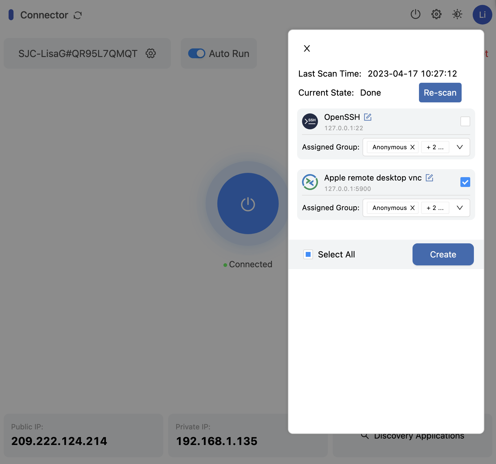
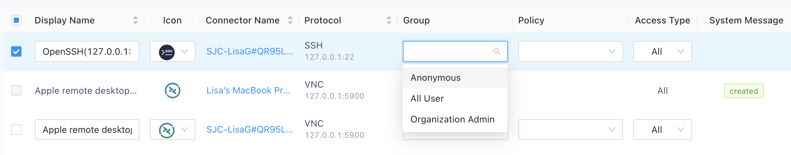

In most cases, you can discover applications automatically on your network. 
Each time you add a connector, you also configure its application discovery settings. The application discovery settings specify:

- How frequently the connector scans the network for applications.
- The application protocols you want to discover. 

After applications are discovered, you can choose which applications you want to manage access to and add those applications to Splashtop Secure Workspace.  

Typically, you add discovered applications to Splashtop Secure Workspace in one of two ways:

- Directly from computers where you have installed the Splashtop Secure Workspace desktop client.
- Remotely from the Splashtop Secure Workspace administrative portal.

It's important to note that you must add the applications you want to manage to Splashtop Secure Workspace. 
Discovered applications are automatically visible in the Splashtop Secure Workspace administrative portal. 
However, you must add applications before you can set group entitlements and assign access policies to them. 

## Add applications from the desktop client

To add discovered applications using the Splashtop Secure Workspace desktop client: 

1. Open **Secure Workspace** on a computer running a connector then click **Next step**. 

2. Select your organization, then click **Launch**. 

1. Type your Username and Password, then click **Sign in**. 
2. Click **Connector** to verify the status is Connected.
3. Click **Discover applications**.
4. Select the applications you want to add, then click **Create**.
   
   

For information about using the desktop client and adding discovered applications using the Splashtop Secure Workspace desktop client, see [Add a connector from the desktop client](./add-a-connector.md).

## Add applications from the administrative portal

You can add any application discovered by the connectors to the Splashtop Secure Workspace administrative portal so you can manage its access policies.

To add discovered applications to the administrative portal:

1. Sign in to your organization URL using your administrative account.
2. Click **Applications**, then click **Applications**.
3. Click **Add Applications**, then select **Discovered Application**. 

   The administrative portal displays the applications that have been discovered by the connectors in the network.

1. Select the checkbox for the application you want to add and select a group, policy, and access type for the application.
   
   

2. Click **Add**.