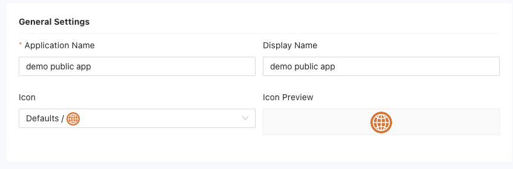
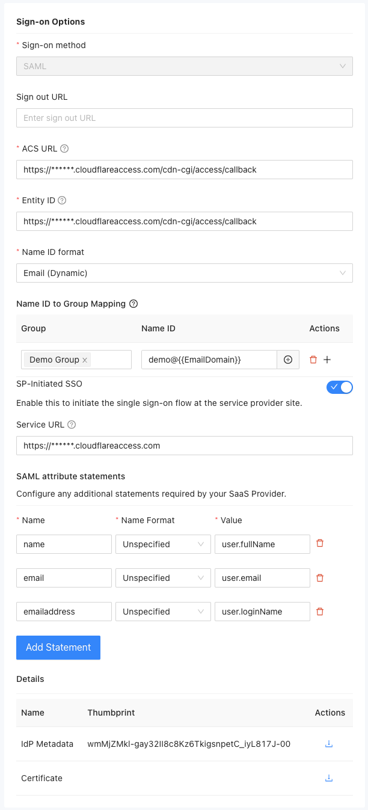
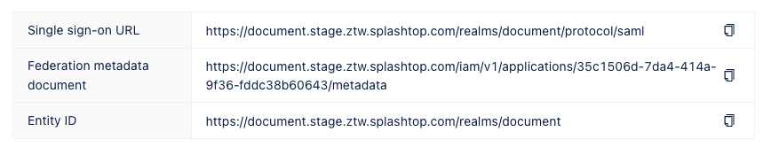
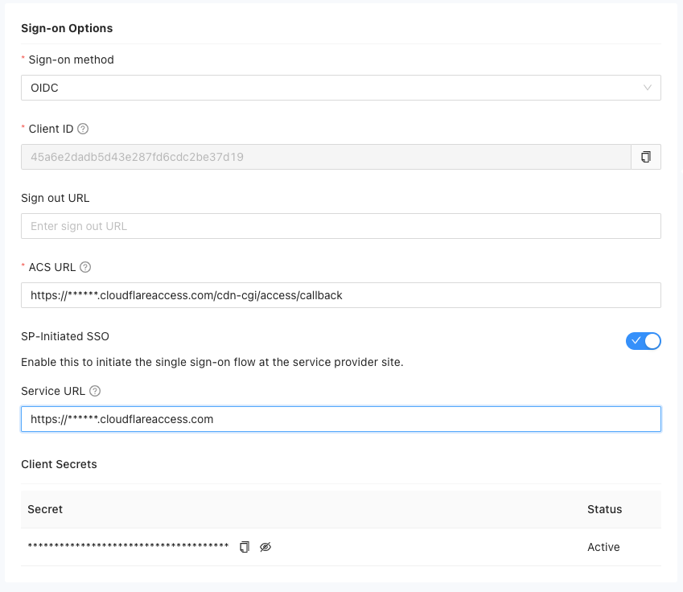
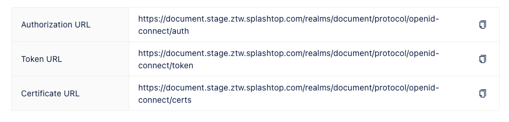

Public applications are applications that you access over the internet using a public endpoint URL.

Adding public applications to Splashtop Secure Workspace requires you to provide information about how users sign in to use the application, including the authentication protocol, the service provider's endpoint URL, and the identity providers that can be used to authenticate the user signing in. All of this information is highly dependent on the public application service provider.

To add a public application:

1. Sign in to your organization URL using your administrative account.

2. Click **Applications**, then click **Applications**.

3. Click **Add Applications**, then select **Public Application**. 

4. For the General Settings, provide the following information:
   * Type the **Application name**.
   * Type the **Display name** to use for the application.
   * Select an **Icon** to use for the application.

   
   
The rest of the information you must provide is highly dependent on the public application service provider. The instructions in the following sections provide a simplified example that you can use as a general model.

## Set sign-on options

The information required for the sign-on options depends on whether the public application uses Security Assertion Markup Language (SAML) or Open ID Connect (OIDC) protocol.
If you aren't sure which sign-on method to select, contact your application service provider before continuing.
If you know the sign-on method your application service provider uses, see the following sections for the next steps:

* [Configure SAML access](#configure-saml-access)
* [Configure OIDC access](#configure-oidc-access)

### Configure SAML access 

To set the sign-on options for a SAML application:

1. Select **SAML** as the sign-on method for the public application.

1. (Optional) Specify the URL where users are redirected after signing out, if applicable.

1. Specify the Assertion Consumer Service (ACS) endpoint URL for the service provider that receives and interprets SAML responses.

1. Provide the globally unique Entity ID for the identity or application service provider.

1. Select the format to use when signing in to the application.
    
    * Select **Username** to sign in with an application account identifier.
    * Select **Email (Dynamic)** to sign in to an application without preregistering an email address.
    * Select **Email** to sign in to an application using a registered email address.
    * Select **Transient** to sign in to an application using a temporary access token.
    * Select **Persistent** to sign in to an application using an authorized access token that can be refreshed.

    If you select **Email (Dynamic)** for the Name ID format, you can assign users to specific groups based on their Name ID. If a user is a member of multiple groups, the first matched group takes effect.

1. (Optional) Enable **SP-Initiated SSO** if you want to set up a service URL to redirect users to the service provider (SP) site for initiating the SAML authentication request.

1. Click **Add Statement**  to include any additional statements required by the SaaS provider.

1. Review the information in the Details section.
    
    The Thumbprint is the fingerprint or hash value of the identity provider's metadata. It is used for verification purposes. You can click the **Download** icon to download the metadata document for the identity provider.
    
    The Certificate is the public certificate for the identity provider. You can click the **Download** icon to download the certificate associated with the identity provider.

    

1. Review the single sign-on information displayed on the right side of the page.
    
    * The Single sign-on URL is URL to initiate the single sign-on process for this application.
    * The Federation metadata document is the metadata document containing information about the federation configuration.
    * The Entity ID is the globally unique identifier for the identity or service provider.
    
    

### Configure OIDC access 

To set the sign-on options for an application that uses OIDC:

1. Select **OIDC** as the sign-on method for the public application.

1. Copy the unique **Client ID** generated for the application to use it in the configuration.

1. (Optional) Specify the URL where users are redirected after signing out, if applicable.

1. Specify the Assertion Consumer Service (ACS) endpoint URL where the user is redirected after authenticating with the identity provider.

1. (Optional) Enable **SP-Initiated SSO** if you want to set up a service URL to redirect users to the service provider (SP) site for initiating the authentication request.

1. View and copy the generated secret key for the application to use it in the configuration.
    
    

1. Review the information displayed on the right side of the page.

    * The Authorization URL is used for authorization during the authentication process.
    * The Token URL is used for token retrieval during the authentication process.
    * The Certificate URL is used to access the certificate used for authentication.

    

## Configure access to the application

After you have configured sign-on method to a public application using the SAML or OIDC settings, you can configure additional settings to provide access to the application and make it available to users.

In the remaining steps, you are going to do the following:

* Grant users access to public applications through group membership.
* Select the policies to apply for groups that are entitled to access the application.
* Configure one or more identity providers to authenticate users who access for the public application.
* Save the application.

To configure access to the public application:

1. Select one or more groups to allow group members to access to the public application.

2. (Optional) Select application access policies for the application.
    
    For an example of how to add application-specific policies, see [Restrict application access](../evaluation/restrict-application-access.md).

    

3. Select at least one identity provider to enable access to the application.
    
    By default, the Splashtop Secure Workspace Identity and Access Management (IAM) service is available as an identity provider. 
    
    To select other identity providers for this public application, you must first add them to Splashtop Secure Workspace.
    For information about adding external identity providers, see [Manage identity providers](./manage-id-providers.md).

4. Copy or download the relevant links and documents for your reference.

5. Click **Save** to add the application to the list of applications.
    
    By default, access to the application is enabled and the group and policy controls take effect immediately. 
    
6. Click the **Enabled** toggle to turn off access to the application temporarily or if you want to delay deployment.