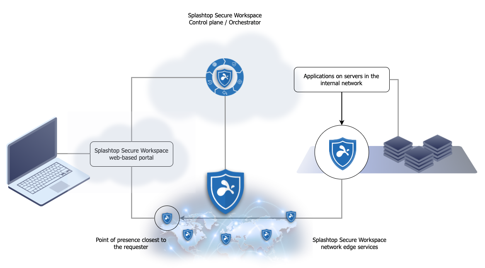

As you learned in [Basic concepts and components](../welcome/basic-concepts-and-components.md), connectors allow you to make internal applications that run on servers in your internal network available to Splashtop Secure Workspace users in your organization. 
Connectors also provide encrypted communication to the Splashtop Secure Workspace edge services for applications that can't be opened in the browser.

Depending on the size and distribution of resources in your organization, you might need connectors in multiple locations or to handle applications for different departments. 
You can use **networks** to group connectors into logical units, much like you use groups to classify users. 
You aren't required to add any networks to your organization. 
However, if you have multiple locations or departments that host different internal applications in your organization, you might find networks convenient for monitoring and managing connector activity. 
For example, if you have three branch offices, you might want to use networks to identify the connectors associated with each office location. 
You can then monitor trends in user activity or network traffic in each location.

You can add a connector to your network by doing the following:

- Install and run the Splashtop Secure Workspace desktop client locally on a macOS, Windows, or Linux computer. See [Add a connector from the desktop client](./add-a-connector.md).

- Install and run the connector from a Docker image. See [Add a connector using Docker](./use-docker.md).

- Install and run the connector on a Kubernetes cluster using the Helm command-line interface. See [Add a connector using Helm](./use-helm.md).

- Install and run the connector remotely using the Linux command-line interface. See [Add a connector from the command-line](./use-linux-cmd-line.md).