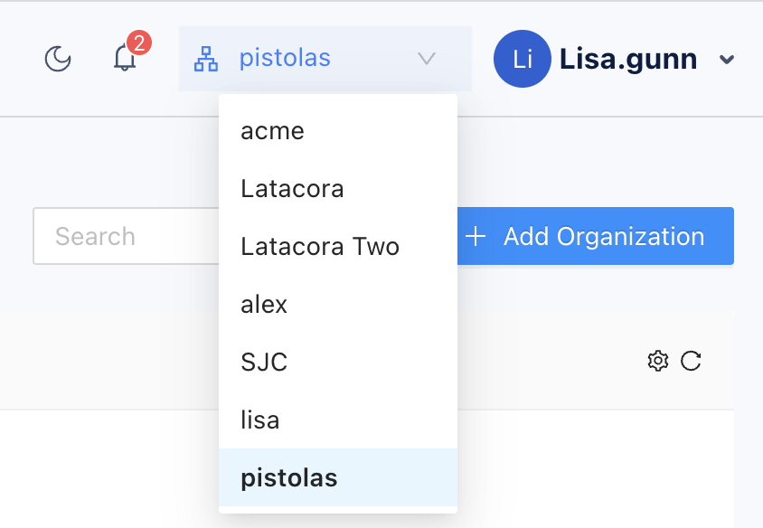

In Splashtop Secure Workspace, an organization represents the top-level entity with resources—like applications and servers—that you manage access to and security for. For example, an organization might be a global business, a school district, or a regional government agency.

However, organizations aren't defined by their size. Organization are defined by the scope of what they contain. Each organization is an independent entity with its own users, groups, applications, network topology, and policies. For example, an enterprise with multiple divisions might have separate organizations for engineering and sales because engineering and sales have very different sets of users and applications to manage and because they share very little infrastructure.

It's important to keep this separation in mind because each organization is managed completely independent from all other organizations. Users in one organization don't have access to resources in any other organization. 

If you have an account that's assigned the Org Admin role, the separation between organizations is transparent because you only ever see the users, groups, applications, network topology, and policies for your own organization. However, if you have an account that's assigned the Super Admin role, you can create and manage multiple organizations. If you manage multiple organizations, it's important to keep your current context in mind. After you select the organization you want to work with, every task you perform in the administrative portal is specific to the organization you selected.

## Create a new organization

The Super Admin role is typically used by third-party service providers who manage independent network infrastructures for multiple clients. Beyond the service provider use case, few organizations need the Super Admin role or the ability to create an manage new organizations. If you have an account that's been assigned the Super Admin role, your first step is create one or more organizations.

To create a new organization:

1. Sign in to your organization URL using your administrative account.
2. Click **Access**, then click **Organizations**.
3. Click **Add Organization**.
4. Type the name of the new organization.

   The organization identifier is generated automatically from the name you specify and the name of the cloud instance that hosts the organization.

5. (Optional) Type additional information about the organization in the **Description** field.
6. Click **Save**.

## Change the current organization

If you manage more than one organization, you can change from one organization to another by opening the list of organization, and then selecting the organization you want to work with.
For example:

After you select a new organization, all of your actions only affect the users, groups, applications, network topology, and policies in that organization. For example, you can invite users and add groups to the new organization.
