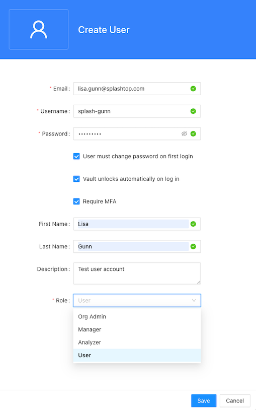

Before your organization's users can use Splashtop Secure Workspace to access applications and resources, they need to have an account. There are a few different ways you can add users to your organization.
You can add users:

* By adding account information for each user manually.
* By sending an email invitation to one or more valid email addresses.
* By importing accounts from an external identity provider like Google Workplace, Azure Active Directory, Okta, or GitHub.

For a user to have a Splashtop Secure Workspace account, they must have:

* A valid email address.
* A user name and password.
* An assigned role.

## Roles and permissions

As discussed in [Organizations and roles](./organizations-and-roles.md), roles are predefined and grant specific privileges. You must assign a role to each user when you add user accounts to Splashtop Secure Workspaace.
Use the following table to identify the most appropriate role to assign your users based on their responsibilities and access requirements. 

<table style="width=100%">
   <colgroup>
      <col span="1">
      <col span="1" style="text-align:center;">
      <col span="1" style="text-align:center;">
      <col span="1" style="text-align:center;">
      <col span="1"style="text-align:center;">
      <col span="1"style="text-align:center;">
      <col span="1"style="text-align:center;">
   </colgroup>
<tr>
   <th>&nbsp;</th>
   <th>User</th> 
   <th>Analyzer</th>
   <th>Manager</th>
   <th>Org&nbsp;Admin</th>
   <th>Super&nbsp;Admin</th>
   <th>Auditor</th>
</tr>
<tr>
   <td>Manage&nbsp;organizations</td>
   <td></td>
   <td></td>
   <td></td>
   <td></td>
   <td style="text-align:center">✓</td>
   <td>Read&nbsp;only</td>
</tr>
<tr>
 <td>Manage&nbsp;access</td>
   <td></td>
   <td></td>
   <td></td>
   <td style="text-align:center">✓</td>
   <td style="text-align:center">✓</td>
   <td>Read&nbsp;only</td>
</tr>
<tr>
 <td>Manage&nbsp;connectors</td>
   <td></td>
   <td></td>
   <td></td>
   <td style="text-align:center">✓</td>
   <td style="text-align:center">✓</td>
   <td>Read&nbsp;only</td>
</tr>
<tr>
 <td>Manage&nbsp;devices</td>
   <td></td>
   <td></td>
   <td style="text-align:center">✓</td>
   <td style="text-align:center">✓</td>
   <td style="text-align:center">✓</td>
   <td>Read&nbsp;only</td>
</tr>
<tr>
 <td>Manage&nbsp;applications</td>
   <td></td>
   <td></td>
   <td style="text-align:center">✓</td>
   <td style="text-align:center">✓</td>
   <td style="text-align:center">✓</td>
   <td>Read&nbsp;only</td>
</tr>
<tr>
 <td>Monitor&nbsp;others'&nbsp;activity</td>
   <td></td>
   <td style="text-align:center">✓</td>
   <td style="text-align:center">✓</td>
   <td style="text-align:center">✓</td>
   <td style="text-align:center">✓</td>
   <td style="text-align:center">✓</td>
</tr>
<tr>
 <td>Monitor&nbsp;own&nbsp;activity</td>
   <td style="text-align:center">✓</td>
   <td style="text-align:center">✓</td>
   <td style="text-align:center">✓</td>
   <td style="text-align:center">✓</td>
   <td style="text-align:center">✓</td>
   <td style="text-align:center">✓</td>
</tr>
<tr>
 <td>Manage&nbsp;personal&nbsp;secrets</td>
   <td style="text-align:center">✓</td>
   <td style="text-align:center">✓</td>
   <td style="text-align:center">✓</td>
   <td style="text-align:center">✓</td>
   <td style="text-align:center">✓</td>
   <td style="text-align:center">Read&nbsp;only</td>
</tr>
<tr>
 <td>Manage&nbsp;organization&nbsp;secrets</td>
   <td style="text-align:center"></td>
   <td style="text-align:center"></td>
   <td style="text-align:center"></td>
   <td style="text-align:center">✓</td>
   <td style="text-align:center">✓</td>
   <td style="text-align:center">Read&nbsp;only</td>
</tr>
</table>

After you add user accounts to your organization, you can use the Splashtop Secure Workspace administrative portal to manage their account information, organize them into groups, and refine access permissions through policies and conditions.

## Add users manually

To add user accounts manually: 

1. Sign in with your administrative account to open the Splashtop Secure Workspace administrative portal.

2. Click **Access**, then click **Users**. 

3. Click **Add Users**.

4. Type the following required information:
    
    * Valid email address for the user account.
    * User name for the account to sign in to Splashtop Secure Workspace.
    * Initial password to create the account and allow the user to sign in for the first time.
    
    By default, the password must be at least nine characters.

1. Select **User must change password on first login** if you want to prompt the user to set a password to sign in.
    
    If you clear this option, the user isn't prompted to set a password to sign in.

1. Select **Vault unlocks automatically on log in** if you want to unlock the personal vault for the user automatically after signing in.

1. Select **Require MFA** if you want to require the user to set up multifactor authentication using a mobile device before signing in.
    Requiring multi-factor authentication provides enhanced security, but the user must have an authenticator application, security key, or SMS service available to sign in if you select this option.

1. (Optional) Type the first name, last name, and description to display for this user.

1. Select the appropriate **Role** for the user from the list of available roles.
    
    For example, if you are an organization administrator, you can select the Org Admin, Manager, Analyzer, or User role.

    

1. Click **Save** to save the account information.

After you create a user account manually, you must share the user name and password that you set for the account with the person who should sign in using that information.
You can click **Re-invite** to send an email with the link to access Splashtop Secure Workspace.
The default email template includes the organization name, the user's sign-in name, and the user's display name.
The user can click **Get started** or copy and paste the URL from the email to sign in and activate the account.

## Send email invitations

To add users by sending email invitations: 

1. Sign in with your administrative account to open the Splashtop Secure Workspace administrative portal.

2. Click **Access**, then click **Users**. 

3. Click **Invite Users**. 

4. Type the email address for the first test user account. 

    If you want to add more than one user with the same settings, click the plus sign (+) and type another email address. 

1. Select the **Default** email template for the invitation.
    
    If you have created a custom email template, you can select that template from the list of available templates.
    For information about how to create a custom email template, see [Add a custom email template](#add-custom-templates).

1. Select **Require MFA** if you want to require the user to set up multifactor authentication using a mobile device before signing in.
    Requiring multi-factor authentication provides enhanced security, but the user must have an authenticator application, security key, or SMS service available to sign in if you select this option.

1. Select **Vault unlocks automatically on log in** if you want to unlock the personal vault for the user automatically after signing in.

1. Select the appropriate **Role** for the user from the list of available roles.
    
    For example, if you are an organization administrator, you can select the Org Admin, Manager, Analyzer, or User role.

    

2. Click **Invite** to send the email invitation.

## Add users from identity providers

You can also add user accounts from an external identity provider to enable single sign-on.
However, provisioning users for Splashtop Secure Workspace from an external identity provider requires some configuration using Security Assertion Markup Language (SAML) or OpenID Connect (OIDC) and Open Authorization (OAuth 2) protocols. 
For information about integrating with external identity providers and configuring single sign-on using those providers [Add identity providers]().

## Add custom templates

To create a custom email template to invite users:

1. Sign in with your administrative account to open the Splashtop Secure Workspace administrative portal.

2. Click **Settings**, then click **Templates**. 

1. Click **Add New**, then select **Email Template.**.

1. Edit the contents of the page.

    For example, you can replace the image displayed in the email with the logo or brand identity for your organization. 
    You can also add custom instructions for new users.

1. Click **Variables** to select different variables to include in the invitation.

    For example, click **Variables**, then select **Onboarding URL** to add a link to a URL with custom onboarding instructions.

1. Type a new template name, then click **Save**.
