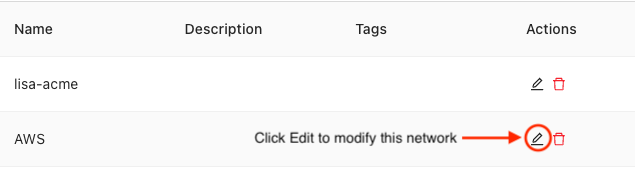
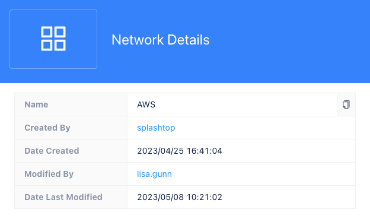

If you have multiple locations or departments that host internal applications in your organization, you might want to add networks to group connectors into logical units. For example, if you have three branch offices, you might want to use networks to identify the connectors associated with each office location.

To view or add a network identifier:

1. Sign in to your organization URL using your administrative account.

2. Click **Deployment**, then click **Connector** to display the connectors currently deployed for your organization.

3. Click **Network** to see the networks you have currently defined.

4. Click **Add network** to add a new network identifier to your organization.

5. Type a **Network name** that makes it easy to identify what the network represents. For example, if the connectors in this network are in a specific geographical region, you can use the network name to identify the region. 

6. (Optional) Add one or more  **Tags** for searching and filtering networks.

7. (Optional) Type a **Description** to provide any additional information about the connectors in this network,

8. Click **Save**. 

Alternatively, you can add a new network identifier—instead of selecting an existing network identifier—when you add any new service-based connector. However, you can only specify the network name when configuring connector settings. To add tags or a description, you can edit the network after adding it.

## Modify network information

You can change or add information about a network at any time.

To modify network information:

1. Sign in to your organization URL using your administrative account.

2. Click **Deployment**, then click **Connector**.

3. Click **Network**.

4. Click **Edit** to modify the name, tags, or description for a selected network.
   
   

5. Click **Save**. 

## View network details

You can view additional information about a network—such as who created it and when it was last modified—by opening the network details.

To view network details:

1. Sign in to your organization URL using your administrative account.

2. Click **Deployment**, then click **Connector**.

3. Click **Network**.

4. Click the name of the network name to open the network details and view information about who created the network, when it was created, who last modified the network, and when it was last modified.
   
   For example:

   
   
## Delete a network

You can delete a network and all of its connectors at any time.

To delete a network and its associated connectors:

1. Sign in to your organization URL using your administrative account.

2. Click **Deployment**, then click **Connector**.

3. Click **Network**.

4. Click **Delete** to modify the name, tags, or description for a selected network.

5. Review the list of connectors associated with the network, then click **Delete** to remove the network and all of its connectors from your organization.