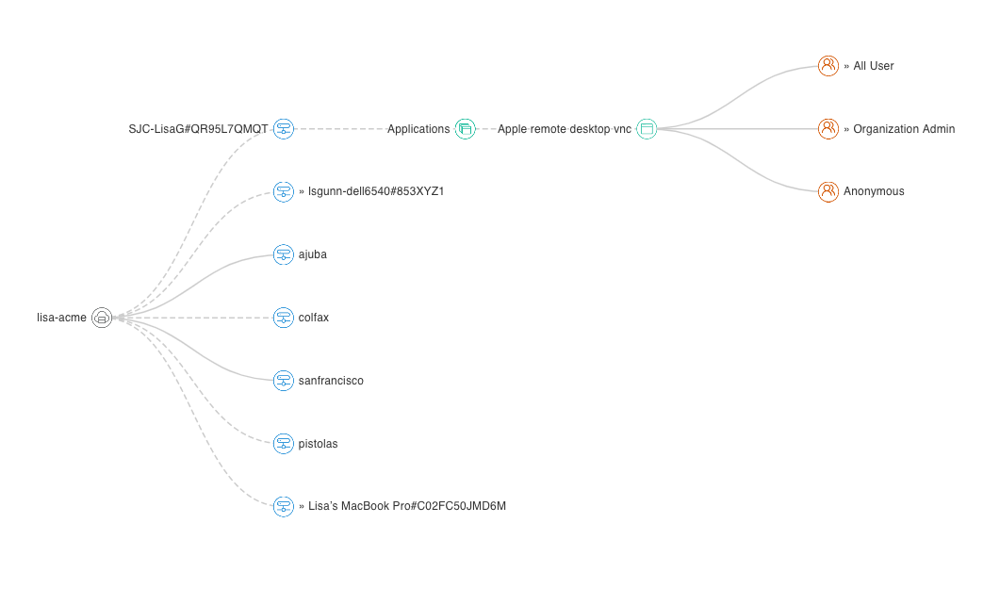
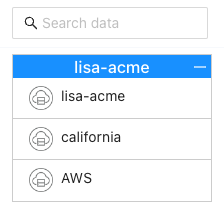
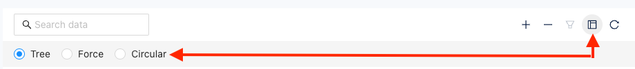
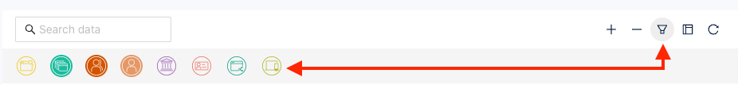

You can view your network topology from within the Splashtop Secure Workspace administrative portal to help you better visualize the network infrastructure deployed for your organization. 

It's important to know how your network is constructed to effectively manage, troubleshoot, and optimize network operations.

## Default network view

The network topology page provides a visual representation of your organization's network infrastructure, along with options to change how the information is presented and the information to include or exclude.
   
The default representation is a horizontal tree format with parent network components on the left and child network components as branches to the right. 

* You can view details of a component by hovering over it.
* You can drill down into child components by clicking the component icon. 

For example, you can click on a connector to see its discovered applications.

To view the network topology for your organization:

1. Sign in to your organization URL using your administrative account.

2. Click **Deployment**, then click **Topology** to display the top-level network layout for for your organization.

3. Click a connector to display additional information.

4. Click the plus (+) to zoom in or the minus (-) to zoom out.

## Select a network

If you have added other [network identifiers](./network-identifier) for your organization, you can change the network topology displayed by selecting a different network name from the list of networks.

For example:

## Change the diagram style

The network topology page gives you three different layout options for viewing your network infrastructure.

* **Tree** displays network components in a horizontal tree view from left to right. In this view, you must click network components to expand the tree.

* **Force** displays network components in a linear connected diagram. In this view, all network components are displayed by default and you can use filters to change the information displayed in the diagram. 

* **Circular** displays network components in a circular connected diagram. In this view, all network components are displayed by default and you can use filters to change the information displayed in the diagram. 

To change the diagram style:

1. Sign in to your organization URL using your administrative account.

2. Click **Deployment**, then click **Topology** to display the top-level network layout for for your organization.

3. Click **Layout**, then select the layout option for viewing your network infrastructure.
   
   

   - Select **Tree** to display network components in a horizontal tree view.
   - Select **Force** to display network components in a linear connected diagram.
   - Select **Circular** to display network components in a circular connected diagram.

## Filter information 

If you view your network topology using the Force or Circular layout option, you can use filters to change the information displayed.
If you turn off all filters, the network topology only displays networks and connectors. 
You can then use filters to display specific information such as the users, groups, and applications for your networks and connectors.

The following filters are available:

- Discovered applications
- Applications
- Groups
- Users
- Policies
- Dynamic credential accounts
- Sharing
- Clients

To filter the information displayed for your infrastructure:

1. Sign in to your organization URL using your administrative account.

2. Click **Deployment**, then click **Topology**.

3. Click **Layout**, then select **Force** or  **Circular**.

4. Click **Filter**, then select the information to include or exclude.

   For example, to include applications, groups, and users, select the Applications, Group, and User filters as illustrated here.
   
   

## Display component details

You can display additional information about any component in the network topology by hovering over its icon. 
The information displayed depends on the type of components you are viewing. 
For example, if you hover over a connector, you can see the public and private IP address of the connector. 
If you hover over an application, you can see information about access to the application and the application protocol.