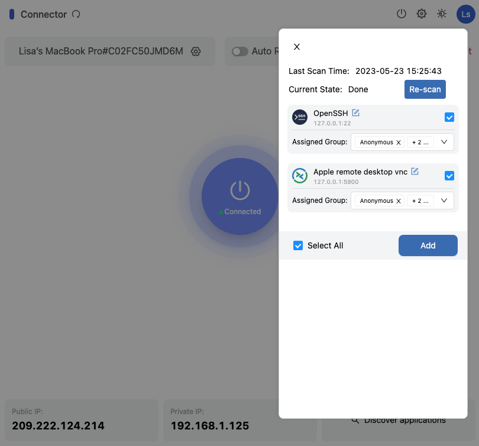
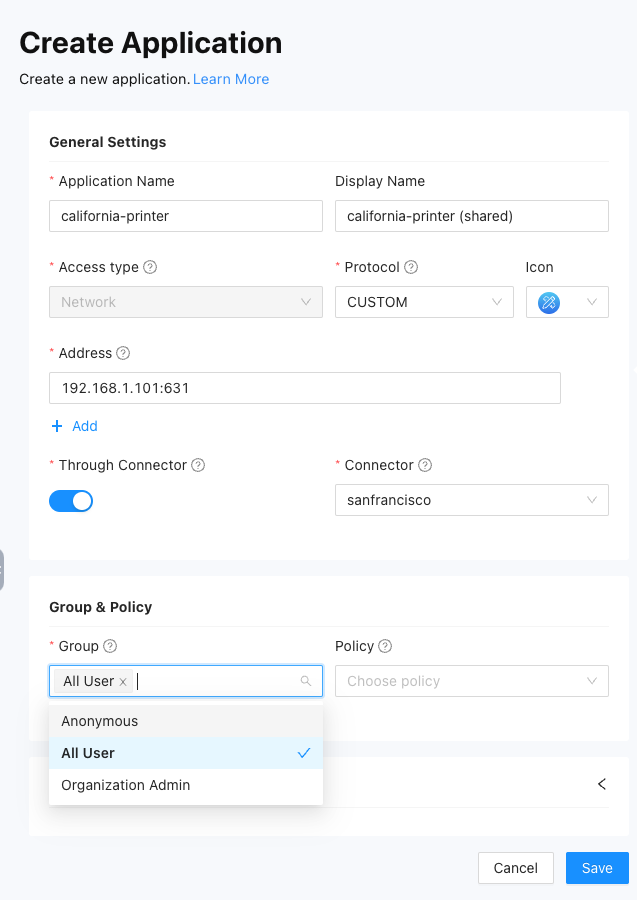
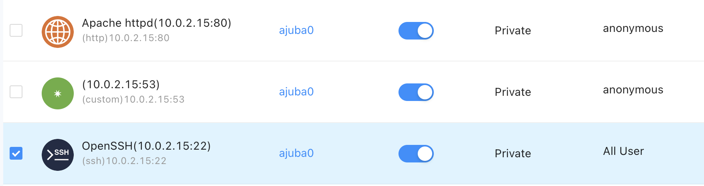
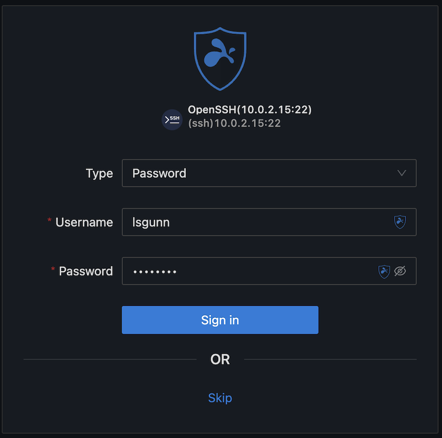
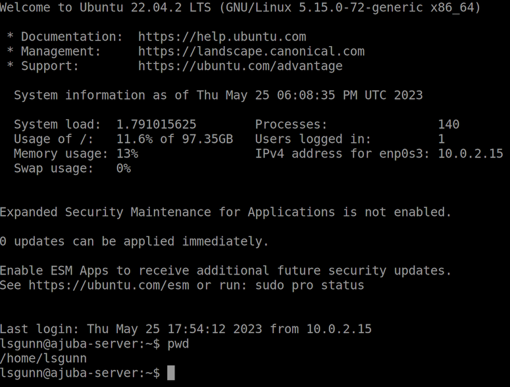

Splashtop Secure Workspace allows you to give users access to applications quickly and efficiently, regardless of whether those applications are on internal servers or hosted in the cloud. 
There are a few different ways you can add applications to the Splashtop Secure Workspace network.
For example, you can add applications directly from computers where you have installed the Splashtop Secure Workspace desktop client or remotely from the Splashtop Secure Workspace administrative portal.

## Discover applications in the test network

In most cases, you can discover applications automatically by running a connector on an internal network and allowing the connector to scan for one or more of the following connection protocols:

* Hypertext Transfer Protocol (HTTP or HTTPS).
* Remote Desktop Protocol (RDP).
* Virtual Network Connection (VNC).
* Splashtop Desktop Protocol (SDP).
* Secure Shell (SSH).
* Kubernetes client API.
* Telnet protocol.

Each time you add a connector, you also configure its application discovery settings. The application discovery settings specify:

- How frequently the connector scans the network for applications.
- The application protocols you want to discover on the network. 

After applications are discovered, you can choose which applications you want to manage access to and add those applications to Splashtop Secure Workspace.  

It's important to note that you must add the applications you want to manage to Splashtop Secure Workspace. 
Discovered applications are automatically visible in the Splashtop Secure Workspace administrative portal. 
However, you must add applications before you can set group entitlements and assign access policies to them. 

## Add applications from the desktop client

In [Deploy connectors in a test network](deploy-test-network-connectors.md), you deployed connectors on two macOS computers using the Splashtop Secure Workspace desktop client. Those two connectors should still be running—with the Connected status—under your administrative account. You're now going to use the connector in the desktop client application to discover local applications on the macOS computers.

To add discovered applications using the Splashtop Secure Workspace desktop client: 

1. Open **Secure Workspace** running locally on the macOS computer.
    
    If you closed the application, sign back in and run the connector to re-establish your connection to the Splashtop Secure Workspace edge.

2. Click **Connector** to verify the status is Connected.

3. Click **Discover applications**.
    
    If you enabled screen sharing and remote login as described in [Prepare for evaluation](./prepare-for-evaluation.md), you should see two local applications discovered.

4. Click **Select All** to add both applications, then click **Add**.
   
    

1. Repeat these steps for the second macOS computer.

## Add applications from the administrative portal

Adding applications directly from a computer where the desktop client is installed is simple, but less common than adding applications from the Splashtop Secure Workspace administrative portal. Note that you must add the applications discovered by connectors to the Splashtop Secure Workspace administrative portal before you can create and manage application access policies.

If you've already adding discovered applications from macOS computers using the desktop client, you can use the following steps to add discovered applications from the Linux computers.

To add discovered applications to the administrative portal:

1. Sign in to your organization URL using your administrative account.
2. Click **Applications**, then click **Applications**.
3. Click **Add Applications**, then select **Add Discovered Applications**. 

    The administrative portal displays all of the applications that have been discovered by the connectors in the network. For example, you'll see the applications discovered on the  computers where the connector is running as a Linux service in the background.

1. Select the checkbox for the application you want to add and select a group and access type for the application.
    
    
   
    The All User and Organization Admin groups are default groups for accounts that are assigned either the User role or the Org Admin role. You can select one of these groups or the built-in Anonymous group for each application.

    You haven't added any policies yet, so you can leave that field empty for now.

    For the Access Type, you can select **All** to allow any type of access, **Network** to allow access using a network-based client, or **Browser** to allow access from a browser.

2. Click **Add** to add the selected application to the Splashtop Secure Workspace application catalog.

## Add a private application manually

In addition to discovered applications, you can use the Splashtop Secure Workspace administrative portal to add private applications and resources manually. For example, you can add printers or smart appliances to your network to simplify access and remote management of those devices.

Adding applications manually to Splashtop Secure Workspace requires you to provide information about how users access the application, including the access method, the application protocol, and the host name or IP address that users connect to. All of this information is highly dependent on the type of application or resource you're adding. Therefore, the following instructions provide a simplified example that you can use as a general model.

To add a private application:

1. Sign in to your organization URL using your administrative account.

2. Open **Applications**, then click **Applications**.

3. Click **Add Applications**, then select **Add Private Application**.

4. Type the **Application name** and the **Display name** to use for the application.

6. Select the type of access that can be used to connect to the application:
   
    * Select **All** to allow any type of access.
    * Select **Network** to allow access over a private network using a network-based client.
    * Select **Browser** to allow access to the application from a browser.
   
7. Select the protocol used to connect to the application or resource.
       
    Regardless of the protocol you select, you must provide at least the following information:

    * Application host by hostname or IP address.
    * Port number used to access the application.
    * Splashtop Secure Workspace connector or the Splashtop Secure Workspace edge location to use for the application.

    For the evaluation, we're going to add a shared printer, so select **CUSTOM**.

1. Specify the hostname or IP address and the port number.

    For example, if you are adding a shared printer as a resource that you want to manage access to, you can specify an address similar to the following:
   
    ```
    192.168.1.101:631
    ```

3. Select **Through Connector** and select the connector to use to access the printer address in the private local area network (LAN).
 
1. Select **All Users** as the group.
    
    

4. Click **Save** to save the application.

## Add a public application

Public applications are applications that you access over the internet using a public endpoint URL.

Adding public applications to Splashtop Secure Workspace requires you to provide information about how users sign in to use the application, including the authentication protocol, the service provider's endpoint URL, and the identity providers that can be used to authenticate the user signing in. All of this information is highly dependent on the public application service provider.

To add a public application:

1. Sign in to your organization URL using your administrative account.

1. Click **Applications**, then click **Applications**.

1. Click **Add Applications**, then select **Add Public Application**.

1. For the General Settings, provide the following information:

    * Type the **Application name**.
    * Type the **Display name** to use for the application.
    * Select an **Icon** to use for the application.
    
    The rest of the information you must provide is highly dependent on the public application service provider. 
    
    The instructions in the following sections provide a simplified example that you can use as a general model.

### Set sign-on options

### Set group and policy options

### Set identity provider options

## Export and import applications

After you add a public or private application to Splashtop Secure Workspace, you can export its configuration information to a JSON file. By exporting the application configuration to a JSON file, you can keep the JSON file as a digital snapshot of a working application's settings. 

You can export the configuration for multiple public or private applications in the same JSON file. However, you can't include both public and private applications in the same JSON file.

After you export the configuration for an application, you can import the JSON file to restore an application if something goes wrong, add an application to another organization, replicate an application on another network, or modify application settings to reuse the configuration in a different context.

### Export application information

To export an application to a configuration file:

1. Sign in to your organization URL using your administrative account.

1. Click **Applications**, then click **Applications**.

1. Select the checkbox for one or more applications, then click **More** and select the appropriate export option.
    
    For example, select a private application, click **More**, then select **Export Private Application**.

    By default, the JSON configuration file is generated and placed in your Downloads folder. You can open and edit this file in a text editor. For example, you might want to modify the application name if you plan to import the application in the same organization you exported it from.

### Import an application

To import an application from a configuration file:

1. Sign in to your organization URL using your administrative account.

1. Click **Applications**, then click **Applications**.

1. Click **Import** and select the appropriate import option.

    For example, click **Import**, then select **Import Private Application**.

1. Drag and drop the JSON file for the application you want to import into the Upload section.

1. Select one or more applications included in the JSON file to import.

1. Select an edge location or a connector, then click **Import**.

## Open an application

After you add applications to the Splashtop Secure Workspace administrative portal, you can open them remotely from the portal to test access.
For example, if the computers in the test network have sharing and remote login enabled, you can use the VNC or OpenSSH client to verify access.

To test access to your discovered applications:

1. Sign in to your organization URL using your administrative account.
2. Click **Applications**, then click **Applications**.
3. Click the OpenSSH application icon or display name for a computer in your test network.
    
    For example, try starting the OpenSSH client that runs on Ubuntu Desktop or Ubuntu Server.
    In this test network, the Ubuntu Server has the IP address 10.0.2.15 and is named `ajuba0`.

     

4. Type a valid Username and Password for an account, then click **Sign in**.
    
    

5. Verify you have signed in using OpenSSH on the remote computer.
    
    For example:

    

You can also test access to applications using the Splashtop Secure Workspace desktop client. You see that in the next section.

## Next steps

Now that you have some applications in the test network, you can start configuring entitlements and policies to control who has access and under what conditions. In [Add users, groups, and policies](./add-users-groups-and-plicies), you'll learn how to add test users and groups to your organization and how to configure a basic access policy.