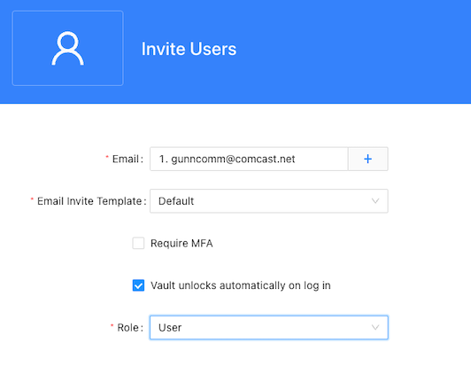
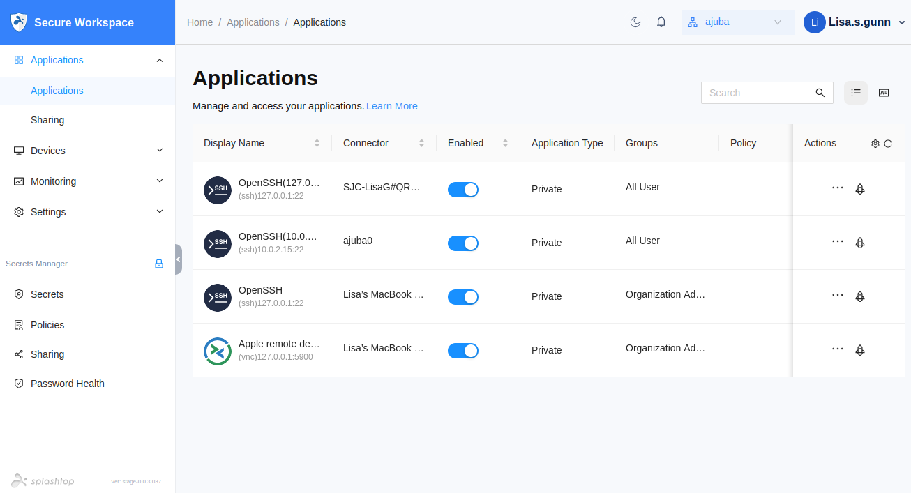

As the organization administrator, you can authorize access for users, groups, and devices, define the conditions and policies that allow or deny access, keep watch over network activity, and perform many other tasks to manage who has access to what in your organization. 
So far, you've performed tasks using only your own administrative account, but to really see Splashtop Secure Workspace in action, you need to prepare a few additional accounts for testing purposes.

## Add users

Users in your organization each need to have their own Splashtop Secure Workspace account. There are a few different ways you can add users to your organization.
For example, you can add users:

* By adding account information for one user at a time.

* By importing account information from an external identity provider like Google Workplace, Azure Active Directory, Okta, or GitHub.

* By preparing accounts for multiple users and sending email invitations.

### Prepare an email invitation

For simplicity and the purposes of evaluation, let’s send email invitations to test  that method for adding new user accounts to the organization. 

To invite users: 

1. Sign in with your administrative account to open the Splashtop Secure Workspace administrative portal.

2. Click **Access**, then click **Users**. 

3. Click **Invite Users**. 

4. Type the email address for the first test user account. 

    If you want to add more than one user with the same settings, click the plus sign (+) and type another email address. 

1. Select **Vault unlocks automatically on log in**.

1. Select a Role for the test account.
    
    You should select the **User** role for at least one email address to add an account for a user with no special permissions. If you have multiple email addresses available for testing, you might want to assign other roles to those addresses. For information about different roles, see [Oragnizations and roles](../welcome/organizations-and-roles.md).

    

2. Click **Save** to send the email invitation.
    
### Activate the new account

To activate the new user account:

1. Check the inbox for the email invitation and open it.

1. Click **Get started** then follow the steps to set up the new user account.

1. Notice that the portal displays the applications you added previously, but the portal doesn't include any of the administrative sections in the navigation.
    
    

    You can open applications from the portal just like did from the administrative portal.

1. Click your user progile, then select **Logout**.

### Sign in with the new account

You now have two accounts—the organization administrative account and a basic user account—for you to test different scenarios. For example, you can use the account you just assigned the User role to access an application using the Splashtop Secure Workspace desktop client application.

To sign in using the new account:

1. Open **Secure Workspace** on the macOS computer in the test network.

1. Click **Log out**, then click **Sign out**.

1. Type the test user account name and password, then click **Sign in**.

1. Click **Download PDF** to save the recovery codes for the test account.

1. Specify a location and file name, then click **Save**.

    After you save your recovery codes, the portal displays the applications that have been added to Splashtop Secure Workspace.

1. Click **Open Browser** for the Apple remote desktop VNC client on the other macOS computer.

1. Provide the credentials for the test user account to open the remote desktop on the target macOS computer.
    
    After you verify access, you can close the browser tab or window to disconnect from the remote computer.

## Add groups

Groups allow you to authorize different set of users to access different applications or meet different criteria. You've already seen that there two default general purpose groups for all users and all organization administrators.

Groups provided entitlements to their members and can be associated with policies to give you fine-grained control over the conditions you configure. For example, you can create separate groups for students and instructors then define different rules to apply to each group.

To add a new group:

1. Sign in with your administrative account to open the Splashtop Secure Workspace administrative portal.

2. Click **Access**, then click **Groups**. 

3. Click **Add Groups**. 

1. Type a new group name—for example, create a new group called `staff` and, optionally, type a display name, and a description for the group.

1. Click **Save** to add the new group to the list of groups.

1. Click **Assign new members**.

1. Click **Assign** next to the test account to add that user to the `staff` group.

## Add a unified policy

With a unified policy, you can combine different types of access controls and conditions to evaluate in a single policy definition. However, this flexibility can lead to complexity. In general, it's best to start with a few simple controls and build more sophisticated policies over time.

To create a unified policy:

1. Sign in with your administrative account to open the Splashtop Secure Workspace administrative portal.

2. Click **Access**, then click **Policies**. 

3. Click **Add Policy**.

1. Type a name for the new unified policy—for example, create a new policy called `Simple authentication`—and select **All User** to apply this policy to all users with access to Splashtop Secure Workspace.

1. Click **Add Control**, then select **User Authentication**.
    
    By selecting User Authentication, you are specifying that you want to trigger the policy to be evaluation when anyone in the All User group attempts to sign in using Splashtop Secure Workspace.

    By default, the policy is set to deny access if none of the conditions you specify are met. To keep this policy simple, you can change the default action to **Allow_MFA** and remove the condition from the policy by clicking the minus (-) next to the first condition.

    If you save this setting, all users will be required to use multifactor authentication every time they sign in. You'll also be signed out of the administrative portal and need to enable multifactor authentication to sign back in. This policy might be appropriate for some organizations, but let's assume we want it to be a bit more lenient. To do that, we need to add conditions to the policy.

 1. Click **Save** to save the policy as-is for now, then click the **Enabled** toggle to turn enforcement of the policy off.

## Add conditions

One problem with setting up a unified policy is that there are default actions for each type of control, there aren't any default conditions to check. So although it's simple to require all users to sign in with multifactor authentication, it's more likely that you would only want to require that under specific conditions. That's where adding conditions that you can use in unified policies comes into play.

To add a new condition:

1. Sign in with your administrative account to open the Splashtop Secure Workspace administrative portal.

2. Click **Access**, then click **Conditions**. 

3. Click **Add Condition**.

1. Type a name for the new condition—for example, create a new condition called `Allowed countries`.

    For this example, let's assume the organization has operations in the United Stated, Germany, and the United Kingdom, so we create condition for these three countries. We can then use the conditions in a policy to allow authentication requests coming from those countries to be allowed by default.

1. Verify the default Condition Type **Authentication and Authorization** is selected.
    
    Depending on the type of information you want to use to allow or deny access, you can select a different condition type. For example, with the DNS condition type, you can allow or deny access based on domain names, like nra.org, or content categories, such as sports or video gaming. For the condition we want to use in the `Simple authentication` unified policy, the Authentication and Authorization condition type is the most appropriate.

1. Click **Add Condition**, then select **Location (Country)**.
    
    

1. Select **United States**, click plus (+) and select **Germany**, then click plus and select **United Kingdom**.

1. Click **Save**.

Now that you have a condition, you can use it in a unified policy. You can also create additional conditions to restrict access to specific days of the week, hours of the day, or network IP addresses.

## Use a condition in a policy

Now let's use the `Allowed countries` condition in the `Simple authentication` policy.

To use conditions in a unified policy:

1. Sign in with your administrative account to open the Splashtop Secure Workspace administrative portal.

2. Click **Access**, then click **Policies**. 

3. Click **Edit** next to the **Simple authentication** policy.

1. Click plus (+), then select the **Allowed countries** condition, **True**, and **Allow**.

1. Click **Save**.

1. Click the **Enabled** toggle to turn enforcement of the policy on.

With this policy, any authentication requests coming for the United States, Germany, or the United Kingdom won't require multifactor authentication. Requests coming from any other country will require multifactor authentication.

You can add additional conditions to the authentication control or add additional controls to the policy. For example, you might want to add a separate condition to deny all authentication requests from specific countries or to add an Application Access control that restricts who can access applications.

## Next steps

Now that you've seen how to add a simple unified policy for authentication requests, you're ready to explore how to define and use more complex application access policies. In [Restrict access to applications](restrict-application-access), you'll see how to create conditions for application access policies and how to assign them to specific applications.