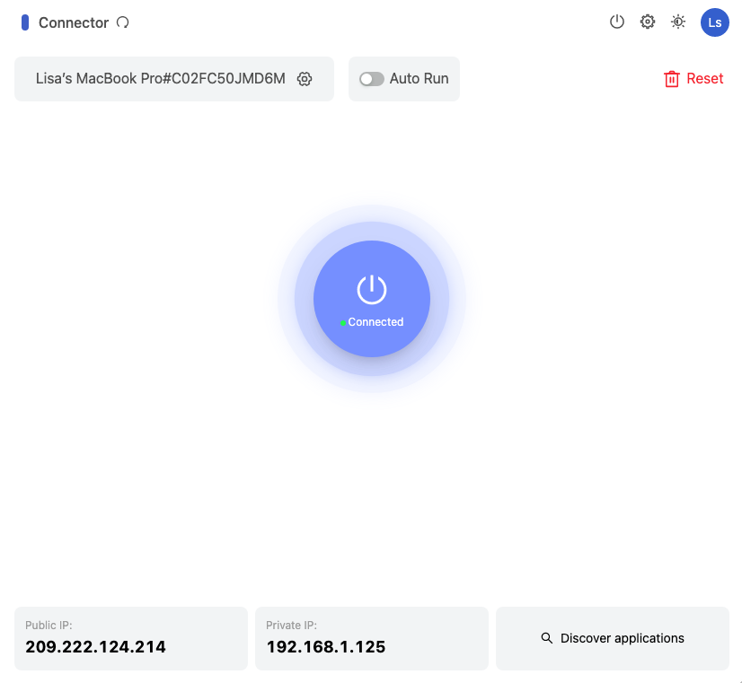
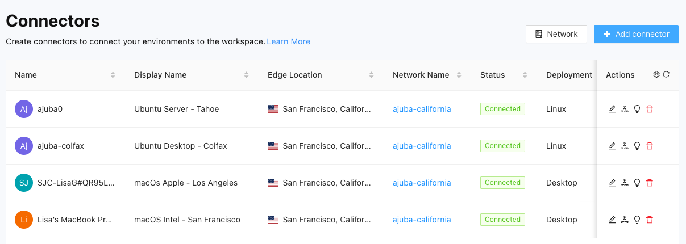

For demonstration purposes, the _Evaluator's Handbook_ assumes that you have a test network that includes the following physical or virtual machines:

* One macOS desktop computer with an Intel chip
* One macOS desktop computer with an Apple silicon chip
* One Ubuntu Linux server

The _Evaluator's Handbook_ also assumes that these computers are part of a private local area network that you’ll be using for testing and evaluating Splashtop Secure Workspace features.
The next step in the evaluation is to deploy Splashtop Secure Workspace connectors to enable the computers in the test network to connect to the Splashtop Secure Workspace edge.

For this evaluation, you are going to do the following:

* Create a new network identifier for this group of computers.

* Download and install a Splashtop Secure Workspace desktop client app on each macOS computer.
   You can follow similar steps to download and install the Splashtop Secure Workspace desktop client on any macOS, Linux, or Windows computer that hosts applications in your private network.

* Download and run the Splashtop Secure Workspace connector from the Linux command line.
   You can follow similar steps to download and run the Splashtop Secure Workspace connector using Docker, Helm, or any distribution of Linux.

## Add a network identifier

By default, your organization provides the top-level of your network infrastructure. 
However, a top-heavy structure can be inconvenient to manage if you have multiple locations, departments, or business units that host applications.
Network identifiers allow you to group connectors into logical units. 
For example, if you have three branch offices, you might want to use networks to identify the connectors associated with each office location.

To add a network identifier:

1. Sign in to your organization URL using your administrative account.

2. Click **Deployment**, then click **Connector** to display the connectors currently deployed for your organization.

3. Click **Network** to see the networks you have currently defined.
   
    For the test network in this evaluation, there's only one—the current organization—and in this example the organization is named `ajuba-acme`.

4. Click **Add Network** to add a new network identifier to your organization.

5. Type a **Network Name** that makes it easy to identify what the network represents. For example, if the connectors in this network are in a specific geographical region, you can use the network name to identify the region. 
   
    For the network in this evaluation, the new network name `ajuba-california`.

6. (Optional) Add one or more **Tags** for searching and filtering networks.
   
    For the network in this evaluation, add the tags `la`, `sf`, `sd`, and `ssh`.

7. (Optional) Type a **Description** to provide any additional information about the connectors in this network.

    For the network in this evaluation, add the description `Test network for evaluators`.

8. Click **Save**. 

## Deploy a connector using the desktop client

There are two primary connector deployment options: 

- You can deploy a connector directly from a desktop client application running locally on a macOS, Windows, or Linux computer.
- You can deploy a connector from a remote repository using a command-line script or a service like Docker or Helm.

Deploying directly from the Splashtop Secure Workspace desktop client is the simplest option because you can use a familiar graphical user interface to download, install, and run the software. 
Let's do that now to install the Splashtop Secure Workspace desktop client on the macOS computers in the test network.

### Download and install software

To download and install the Splashtop Secure Workspace desktop client on a local computer:

1. On the macOS computer with the Intel chip, sign in to your organization URL using your administrative account.
2. Click **Deployment**, then click **Connector** to display the list of connectors in your organization.
3. Click **Add connector**.
4. Select **With the SSW Desktop App**, then click **Next**.
5. Click **Mac** and **Intel Chip**.
6. Click the first step to download the connector for the operating system and architecture you selected.
7. Open the downloaded file and follow the installation instructions to install the software.

### Run the connector

After you install the desktop client application on the local computer, you can use the local desktop client to run the connector.

To run the connector:

1. Open **Secure Workspace** on the computer where your installed the  Splashtop Secure Workspace desktop client, then click **Next step**.
   
    For example, on the macOS computer, go to **Applications** and open **Secure Workspace**.

1. Select the name of your organization from the list of recent organizations, then click **Launch**.

1. Type the Username and Password your administrative account, then click **Sign in**.

1. Click **Connector** in the sidebar.
   
    By default, the connector location is prepopulated using the point of presence closest to your current location.

1. Select **Allow Remote Control** if you want to manage the connector from the Splashtop Secure Workspace administrative portal.

1. Click **Application Discovery** if you want to customize the settings used to discover applications such as the scan interval, IP address range, or protocols to look for.

1. Click **Run Connector** to connect to the Splashtop Secure Workspace network edge.

After the connection is made, you should see the connector status is Connected.



You can click **Discover applications** to find local applications immediately after the connector status changes to Connected. However, this step is covered in more defail in [Add applications](./add-eval-applications.md) so you can focus on getting the test network up and running.

### Deploy a second connector

Repeat the steps in the previous sections to deploy a connector on the macOS computer with the Apple silicon chip.

To install the Splashtop Secure Workspace desktop client on the second macOS computer:

1. On the macOS computer with the Intel chip, sign in to your organization URL using your administrative account.
2. Click **Deployment**, then click **Connector** to display the list of connectors in your organization.
3. Click **Add connector**.
4. Select **With the SSW Desktop App**, then click **Next**.
1. Select **Mac** and **Apple Silicon** to download the desktop client. 
1. Download and install the desktop client.
1. Open the **Secure Workspace** application.
1. Click **Connector**, then click *Run Connector*.

## Deploy a connector using the command line

Deploying a connector from a remote repository requires you to run a fairly complex command in a terminal shell. 
However, you can use the Splashtop Secure Workspace administrative portal to construct the command for the platform you use. 
If you choose to deploy from the command line, you can also automate the process using scripts and other deployment tools.

To illustrate how to deploy a connector from a remote repository, let's use a script from the Linux command line.

### Configure connector settings

To add a connector by running a script in a terminal:

1. Sign in to your organization URL using your administrative account.
2. Click **Deployment**, then click **Connector** to display the connectors currently deployed for your organization.
3. Click **Add Connector**. 
4. Click **Headless / CLI**, then click **Next**.
5. Configure the settings for the connector and application discovery, then click **Next**.
   
    | For this | Do this |
    | :--- | :--- |
    | Connector name | Type a name for the connector process to use. You should avoid including spaces or special characters. |
    | Display name | Type the name you want displayed in the administrative portal for the connector. |
    | Network | Verify the network displayed is the correct organization. Optionally, you can add a new network identifier for the connector instead of using your organization. For more information about adding networks, see [Add a network identifier](./network-identifier). |
    | Edge location | Select an appropriate edge location. |
    | Auto bandwidth detection | Select this option to allow the connector to monitor bandwidth changes to ensure the best performance for the connector. | 
    | Cluster mode | Select this option if you want to install the connector on multiple nodes to form a cluster. For example, you can select this option to add and deploy multiple instances of the connector to make your network more resilient and to prevent service interruptions. |
    | Scan interval | Set the frequency for the connector to check for changes to the applications. In most cases, the default interval of 20 minutes is appropriate. |
    | IP range | Set an IP range for discovering applications, if appropriate. You can use the Classless Inter-Domain Routing (CIDR) format—for example, 192.168.20.0/24—to specify the range. Alternatively, you can specify a static IP address or a range of addresses using the following format: 192.168.20.0-192.168.20.100 |
    | Protocols | Click **Select all** to scan for all application protocols. |

1. Select **Linux** as the deployment method.

    You should see a command line that looks similar to the following example, but with a full token instead of the truncated token shown here:
   
    ```
    export SSW_CONNECTOR=connector-acme-ajubaacm-ajubacolfax && \
    curl -fsSL "https://s3.us-west-2.amazonaws.com/splashlock-assets.splashshield.ai/connector/stage/setup.sh" | sudo bash -s $SSW_CONNECTOR && \
    sudo $SSW_CONNECTOR -install -configPath /etc/$SSW_CONNECTOR \
    -conf [token removed] && sudo systemctl start $SSW_CONNECTOR
    
    ```
   
    If you are deploying on a cluster, click **Add Instance** to automatically construct the command line for each additional instance. A number is appended to the connector name for each instance you add. For example, if you set the the connector name to `sanfrancisco`, the first instance is named `sanfrancisco1`, the second instance is named `sanfrancisco2`, and so on.

1. Copy the command displayed and leave the deployment page open in the administrative portal.

### Install the connector

To install the connector from the command line:

1. Open a terminal shell on the Linux computer.
2. Verify that you have sudo permission by running the following command:

    ```
    sudo --list
    ```
   
4. Paste the command you copied from the administrative portal.
   
    The command line sets an environment variable, downloads the connector setup script, executes the setup script using the environment variable, and starts the connector. Between downloading the script and executing it, you might be prompted to provide your password to run the command using your `sudo` privileges.
   
    After running the command, return to the administrative portal deployment page to verify the status of the connector is Connected.

1. Click **Done**.

## View connector status

If you completed the steps in the previous sections, you now have a small test network to try out the evaluation scenarios.

To view the status of your network:

1. Sign in to your organization URL using your administrative account.
2. Click **Deployment**, then click **Connector** to display the connectors currently deployed for your organization.
1. Verify your connectors are running.
    
    For example, the test network for the _Evaluator's handbook_ consists of two macOS computers and two Linux virtual machines:

    

## Change the information displayed

By default, the connectors list displays the following details about each connector:

- Connector name
- Connector display name
- Splashtop Secure Workspace edge location
- Network name
- Current status of Connected, Disconnected, or Unknown
- Deployment type
- Private IP address for the connector
- Public IP address for the connector
- Date the connector was deployed
- User who deployed the connector
- Date the connector was last modified
- User who last modified the connector

To change the columns displayed:

1. Sign in to your organization URL using your administrative account.
2. Click **Deployment**, then click **Connector**.
3. Click **Settings** in the Actions column.
4. Clear the checkbox for any column you want to hide.
5. Select the checkbox for each column you want to show.

## Next steps

After you have connectors running on the computers in your test network, you can discover and add applications from those computers to the Splashtop Secure Workspace network infrastructure. In [Add applications](./add-eval-applications.md), there are examples of some of the ways you can add applications to Splashtop Secure Workspace to manage access to those applications. 