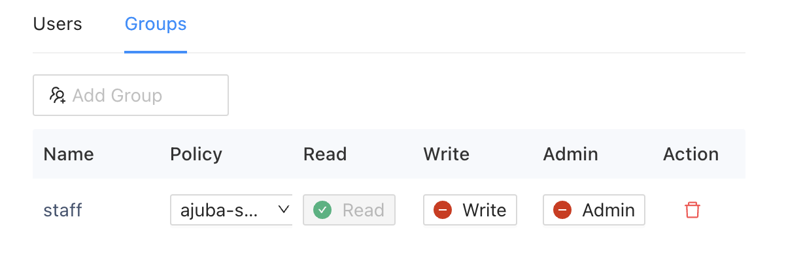

With Splashtop Secure Workspace, you can securely store, organize, use, and share any type of secret information you want to manage. Secret information—like passwords, private keys, and personal identifying information—is stored in a **vault**. 
A vault is a secure and isolated space for encrypted data.

Secrets stored in the vault use zero-knowledge encryption to ensure that your data is stored in an encrypted format that can only be decrypted on the client side by you as the owner of the private key. Splashtop Secure Workspace components don't have access to your keys and can't decrypt any secret content you store.

## What you can store as secret information

You can store many different types of private or confidential information as secrets in a Splashtop Secure Workspace vault.
For example, you can use the vault to securely store the following information:

* Passwords
* Secure shell (SSH) keys
* API keys
* Sensitive notes
* Personal identification cards 

After storing secret information in the vault, you can easily use and share credentials without exposing the secret information itself. For example, you can prepare dynamic credentials that autofill passwords for access to applications and websites to streamline the user experience.

## Personal and organization-level vaults

In Splashtop Secure Workspace, secrets are stored and managed in either a personal vault named **My Vault** or an organization-level vault named with the organization name.
By using two secret vaults, Splashtop Secure Workspace ensures that sensitive information remains protected for both individual users and the organization and secret information can only be accessed by authorized individuals.

### Personal vault

Each Splashtop Secure Workspace user has a unique personal password vault for secret information. Only the individual user who possesses the master password and the private key can access the secrets stored in the personal vault. By providing My Vault,Splashtop Secure Workspace ensures that users have the utmost privacy and control over their own secret information. If other users share secrets with you, those secrets are also included in your personal My Vault.

### Organization-level vault

The vault for an organization has the same name as the organization it holds secret information for. For example, the organization name `ajuba` also has a vault for secret information named `ajuba`. Organization-level vaults are owned by users who are assigned the Org Admin or Super Admin role. Organization vaults serve as shared repositories of secrets within the organization. 

Most users don't have access to their organization's secret vault. However, administrators can create and share secrets in the organization vault and share those secrets from the organization vault with specific groups or users. When you share secrets from the organization vault with other users in the organization, they are added to each of those user's My Vault, ensuring easy access and centralized management.

## Add a secret

As an organization administrator, you are most often going to add secret information to the organization vault so you can share it with authorized accounts when necessary. In this test network, the organization name is `ajuba`, so `ajuba` is the vault that contains secret information for the organization.

To add secret information to the vault:

1. Sign in with your administrative account to open the Splashtop Secure Workspace administrative portal.

1. Under Secrets Manager, click **Secrets**, then click the organization vault name—in this example, **ajuba**—to display the empty policies list.
    
    If you want to add secret information to your personal vault instead of the organization's vault, click **My Vault**.

1. Click **Add Item**.

1. Select the type of secret inforamtion you want to add to the vault.
    
    For this example, you are going to add a secret for accessing a discovered application, so click **Zero Trust Application** from the Secrets category.
    
    Secrets:
    
    * Website
    * One-Time Passcode
    * Application
    * API Key
    * Zero Trust Application
    * Splashtop Remote Computer

    Commonly Used: 
    
    * SSH Key
    * Note
    * Bookmark
    
    Personal Info: 
    
    * Name
    * Email
    * Phone
    * Address
    * Company
    * Website
    
    Payments: 
    
    * Bank Accounts
    * Credit Card
    
    IDs:

    * ID Card
    * Social Security Number
    * Driver's License
    * Passport
    * Tax Number

1. Select an application from the list of applications that have been added to Splashtop Secure Workspace.
    
    For example, select an OpenSSH client running on Ubuntu Server.

1. Type a unique name for identifying this secret.

1. Select the Type of authentication for this secret.
    
    After you select an authentication type, the information you must provide changes to reflect that type. For simplicity in this example, select **Password**.

    After you select Password, type a user name and password for access to the application. You can also add an optional note about this secret.

1. Click **Save** to save the secret in the vault.

## Organizing secrets

You can use folders to organize secrets in your personal or organization vault. Folders can make it easier to categorize, manage, and share secret information with others inside or outside of your organization. You can also nest folders to create a logical hierarchical structure for related information.

To add a folder for organizing secrets:

1. Sign in with your administrative account to open the Splashtop Secure Workspace administrative portal.

1. Under Secrets Manager, click **Secrets**, then click the vault name—either **My Vault** or **ajuba**—to display the secrets list.
    
1. Click **Add Folder**.

1. Type a name for the folder, then click the checkmark to save it.
    
    After you create a folder, you can click the folder name to open it, Insider the new folder:
    
    * Click **Add Item** to add new secrets to it.
    * Click **Add Folder** to create another interior folder.

    If you have existing secrets that belong in the new folder, select **Move** from the list of Actions for that secret. You can then select the new location of the secret and click **Move**.

## Create a policy for secret information

After you add one or more secrets to a vault, you can use policies to set conditions that control when, how, or where secret information can be used.

Much like application policies, there are two ways you can control access to secrets:

* By adding a secret read, write, or permission control to a unified policy.
* By creating and assigning a read, write, or permission policy to a specific secret or group of secrets.

If you add secret controls to a unified policy, they are applied globally to all secrets. The global policies can't be assigned to specific secrets. Therefore, it's often more practical to create policies that you plan to assign to individual secrets or a folder with a specific set of secrets. 

To create and assign a policy to a secret:

1. Sign in with your administrative account to open the Splashtop Secure Workspace administrative portal.

1. Under Secrets Manager, click **Policies** to display the empty policies list.

1. Click **Add New**.

1. Type a unique policy name.

1. Click **Add Control**, then select the type of control you want to add:
    
    * Select **Secret Read** to specify the conditions to evaluate if there's an attempt to read a secret where this policy is applied.
    * Select **Secret Write** to specify the conditions to evaluate if a new secret is being created or an existing secret modified in a folder or vault where this policy is applied.
    * Select **Secret Permission** to specify the conditions to evaluate if there's an update to the permissions associated with a secret where this policy is applied.

    You can create separate policies for each control or combine them in a single policy.
    By default, the Date and Time condition is added when you select a control. You can click **Delete** to remove this condition from the control. For example, if you want to use the location or network IP address to determine whether a secret can be read, delete the default Data and Time condition.

    For this sample secrets policy, click **Delete** to remove the Date and TIme condition.

1. Select the Default Action for the control.
    
    In most cases, you should select **Deny** if you are defining conditions for allowing access. If you are defining conditions for denying access, you can select **Allow** or **Allow_MFA** as the default action. 

    For this sample secrets policy, leave **Deny** as the default action.

1. Click **Add Condition**, then select the type of condition you want to add, such as Date and Time, Location, Network, Browser, Extension, or OS.

    For this sample secrets policy, select **Network** as the type of condition.

1. Specify the conditions to evaluate for the selected condition type.
    
    For example, specify the timezone, days, and hours for the Date and Time condition, or the list of countries for the Location condition.

    For this sample secrets policy, specify an IP address range in CIDR format—for example, `192.168.0.0/24`—as the condition.

1. Select the action if for the condition is met.

    For this sample secrets policy, select **Allow** as the type of condition.

1. Add conditions and controls to the policy, as needed, then click **Save**.

    Now that yu have a policy, you can assign it to a secret.

## Assign a policy to a secret

To assign the new policy to a secret:

1. Sign in with your administrative account to open the Splashtop Secure Workspace administrative portal.

1. Under Secrets Manager, click **Secrets**, then click the vault name—either **My Vault** or **ajuba**—to display the secrets list.

1. Select a specific secret or a secrets folder, then click **Details**.

1. Click Users or Groups o specify a user or a group with which to share the selected secret or secrets folder.
    
    For example, click **Groups**, then select the **staff** group.

1. Select the policy you saved to apply it controls and conditions to the selected secret or secrets folder and the selected user or group.

1. Select the permissions from the policy to apply to the selected user or group.
    
    For example, turn on **Read** permissions for the **staff** group.

    

1. Click **Save** to save the assignment.

<!--
## Sharing secrets

Splashtop Secure Workspace offers granular control over sharing secrets. Users have the ability to share secrets at both the individual secret level and the folder level. When a folder is shared, the sharing is recursive, meaning that all the secrets and subfolders within the shared folder are also shared with the designated recipients. This simplifies the process of sharing a collection of secrets, ensuring that all relevant information is accessible to the intended users.

## Accessing secret information

You can use any Splashtop Secure Workspace client to work with secret information stored in either vault. The clients provide encryption and decryption and convenience features like auto-filling passwords for access to websites, desktop applications, and mobile apps.

## Analyzing password health

By storing secrets in Splashtop Secure Workspace, you can also gain insight into password health by reviewing the strength and complexity of the passwords yu use. This password analysis helps to promote best practices for password management and to ensure accounts remain secure.

-->