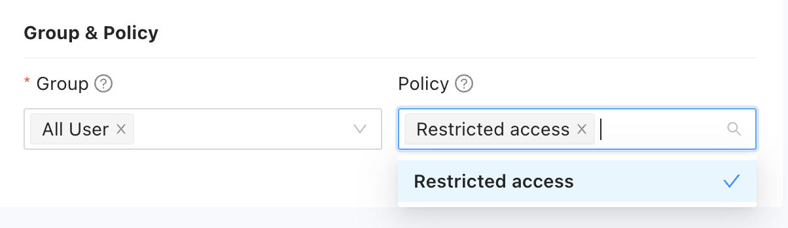

You can add application access controls in unified policies or create separate application-specific policies independent of unified policies. 

## Add an application access control

As mentioned in [Add a unified policy](./add-users-groups-and-policies.md#add-a-unified-policy), unified policies are intended to consolidate and simplify policy management. In most cases, you add controls to a unified policy when you want broad enforcement of a condition.
For example, you might add an application access control to a unified policy if you want to evaluate a condition across all applications in the organization and for every application access request. 

You already have a Location (Country) condition that specifies three countries. Let's reuse that condition in an application access control to prevent applications from being used if the request doesn't originate in an allowed country.

To add an application access control to a unified policy:

1. Sign in with your administrative account to open the Splashtop Secure Workspace administrative portal.

2. Click **Access**, then click **Policies**. 

3. Click **Edit** next to the **Simple authentication** policy.

1. Click **Add Control**, then select **Application Access**.

1. Leave the default action to Deny access

1. Select the **Allowed countries** condition, **True**, and **Allow**.

1. Click **Save**.

With this policy, only authenticated users requesting access to applications from within an allowed location are granted access. All other users are denied access to applications in the organization.

## Add an application policy

If you want finer grain control over application access, you might want to define application-specific access policies in addition to or as a replacement for application access controls in unified policies. Unlike unified policies, you can create conditions directly in application policies.

To add an application policy:

1. Sign in with your administrative account to open the Splashtop Secure Workspace administrative portal.

1. Click **Applications**, then click **Policies** to display the application policies list.

1. Click **Add Policy**.

1. Type a name for the new application policy—for example, create a new policy called `Restricted access`—and select **All User** to apply this policy to all users with access to Splashtop Secure Workspace.

1. Click **Add Condition**, then select **Date and Time**.

1. Select Allow_MFA as the default action. 
    
    If no conditions are met, user must provide multifactor authentication to access to application.

1. Select a Timezone for evaluating the time of day associated with the access request.
    
    For example, select UTC-08:00 | UTC-07:00 to select Pacific Daylight | Pacific Standard Time.

1. Set a start time and an end time for the policy to be in effect.
    
    For example, select a start time of **06:00** and an end time of **18:00** to have the policy in effect from 6:00 AM to 6:00 PM.

1. Select the days of the week for the policy to be in effect.

    For example, select Monday, Tuesday, Wednesday, Thursday, Friday to set the standard working days.

    If you want to add aany additional conditions, you can click **Add Condition** and select another condition type. For example, if this policy only applies when application access requests originate in the United States, you can select Location and then select United States.

1. Select **Allow** to allow users to access applications without multifactor authentication during the specified hours and days.

1. Click **Save** to save your new application policy.
    
    Now that you have an application policy, you can assign it to an application.

To assign the new policy to an application:

1. Sign in with your administrative account to open the Splashtop Secure Workspace administrative portal.

1. Click **Applications**, then click **Application** to display the applications list.

1. Click **Edit** next to the application you want to assign this policy to.
    
    For example, click Edit for the SSH client running on the macOS computer with the Apple silicon chip.

1. Under Group & Policy, select your `Restricted access` policy.
    
    

1. Click **Save**.

## Next steps

Now that you've seen how to add application access controls to a unified policy and how to create application-specific policies, let's look at how you can store and manage secret information—like passwords and API keys—to allow access to resources in your organization. 

In [Manage secrets](manage-secrets.md), you'll learn the types of information you can store, how to add secrets to the secure storage space known as a vault, and how you can manage secrets using folders and policies.