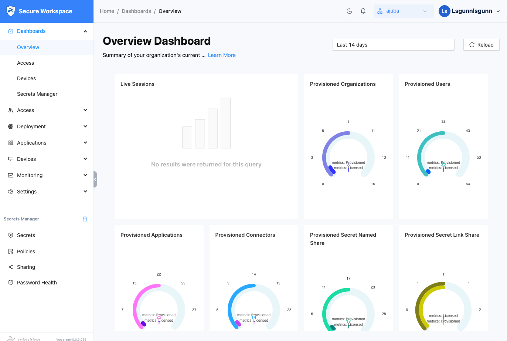

To find out if Splashtop Secure Workspace solves the security challenges your business faces, you can sign up for a free trial. 
After you register, you’ll receive an email invitation with information about your default account and the organization URL that’s been created for you to use.
The email also includes instructions and links to information to help you get started.

## Activate your account

After you register, check your Inbox for an email notification from Splashtop. 
This email notification has the information you need to sign in and activate your account in the Splashtop Secure Workspace cloud.

Your default account can be assigned an Org Admin role with the ability to manage a single organization or a Super Admin role with the ability to create and manage multiple organizations.
Because most administrative tasks are performed in the context of a specific organization, the _Evaluator's Handbook_ assumes you have been assigned the Org Admin role.
If you manage more than one organization, see [Managing multiple organizations](./manage-multiple-organizations.md) after you activate your account.

To activate your account: 

1. Click the **Get started** link in the email or copy and paste the URL into your browser. 
    
    This step confirms your email address.
   
1. Set the password to activate your account, then click **Next**. 
    
    After you set a password, you are prompted to set a passcode for managing secrets in a private vault for your account. 
   For simplicity, you can use the same password you selected for your username or for better security choose something else for managing secrets in your vault. 

1. Click **Confirm** to save the password for your account and your private vault. 

After you complete these three steps, you’re ready to start exploring the Splashtop Secure Workspace administrative portal. 

## Explore the administrative portal

By default, the administrative portal displays the Overview dashboard for your organization and a navigation panel for accessing and interacting with different Splashtop Secure Workspace features. 
The Overview dashboard won’t display any information about your organization until you start configuring organization details—like adding users and configuring access policies—but you can review the types of information the overview includes.

You can click **Dashboards** to collapse the list of dashboards.
Your organization and user name are displayed in the upper right corner.
For example:

The Splashtop Secure Workspace navigation is split into two parts:

* Splashtop Secure Workspace features for managing users, groups, devices, policies, and the network infrastructure.
* Security Manager features for managing secret information stored in the secrets vault.

You can navigate to Splashtop Secure Workspace features by clicking the following sections: 

* Click **Access** to manage users, groups, and access policies.

* Click **Deployment** to manage your network infrastructure.

* Click **Applications** to manage applications and application access policies.

* Click **Devices** to manage device profiles, view information about connected clients, and download software.

* Click **Monitoring** to view information about events, active sessions, and session recordings.

* Click **Settings** to configure external identity providers, add custom templates, save address and domain lists, and view API keys.

## Next steps

After you have a general sense of how to navigate the administrative portal, you can begin deploying the network infrastructure and preparing access to applications. If you are the administrator for a single organization, continue to [Deploy connectors in a test network](./deploy-test-network-connectors.md). If you manage more than one organization, see [Managing multiple organizations](./manage-multiple-organizations.md) before you proceed to [Deploy connectors in a test network](./deploy-test-network-connectors.md). 