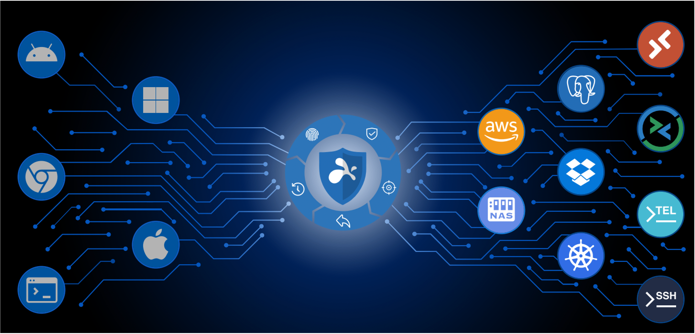

Splashtop Secure Workspace is an easy-to-use, cost-effective, and integrated security platform built to help small to mid-size organizations solve the security challenges of the modern enterprise. 
It enables IT teams to manage access to resources anywhere—regardless of whether those resources are on site in an internal network, in a private or public cloud, or from a software-as-a-service provider—and from any location without affecting network performance or the end user experience.

With Splashtop Secure Workspace, organizations can get robust enterprise-grade security without the enterprise IT budget.