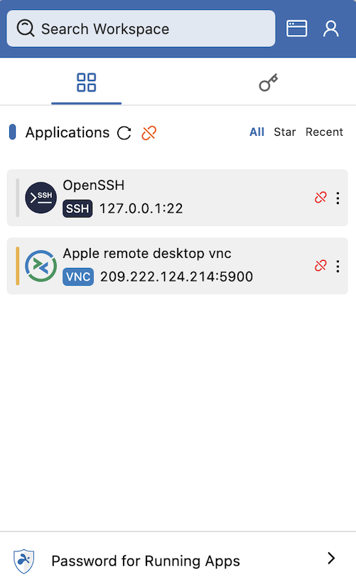
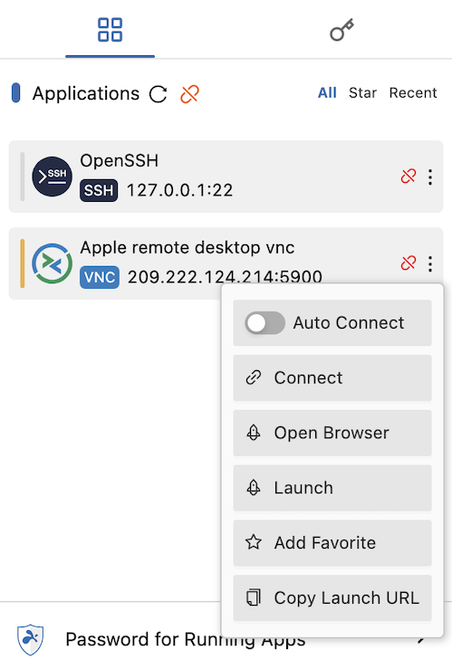

After you install Splashtop Secure Workspace on a computer, you can access a minimized version of the desktop client by clicking the **Secure Workspace** icon displayed in the menu bar on macOS or in the system tray on Windows. 
The minimized desktop client gives you quick access to your applications, secrets, and connectors. 
For example, the minimized desktop client is the most direct path to access applications.

To start applications from the minimized desktop client:

1. Click the Secure Workspace icon displayed in the menu bar.
The Applications tab is displayed by default.

    

1. Click **More actions**—the vertical three-dot ellipsis menu—for the application you want to open.

    

1. Click **Open Browser** to launch the application in a browser.

1. Sign in using valid credentials for the selected application and you’re all set to continue working.

If you need to use features that aren’t displayed in the minimized desktop client—for example, the Connections map or client Settings—you can expand the minimized version of the client to display those features.