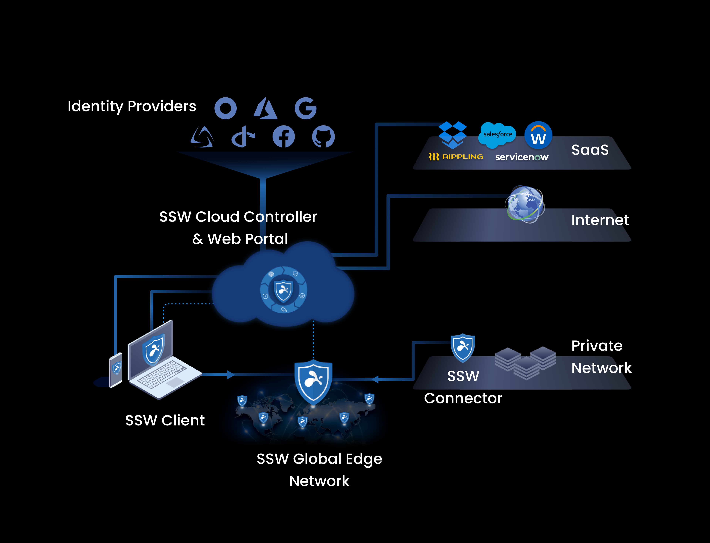
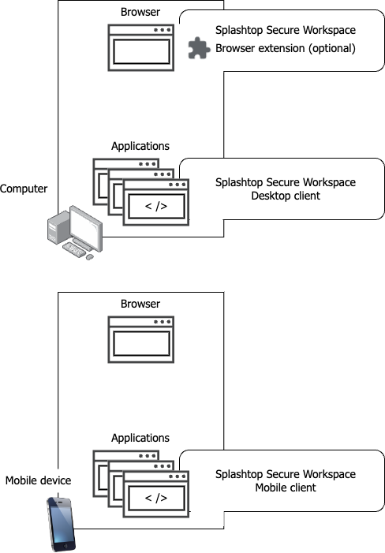
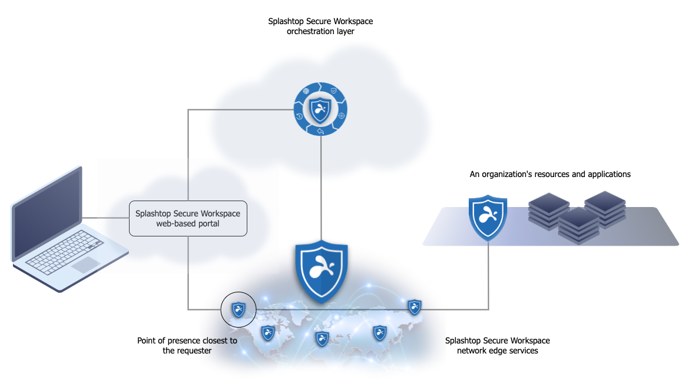

Instead of many individual and specialized products, Splashtop Secure Workspace is an integrated and holistic security platform. 
It offers broad coverage for remote access with high performance, low overhead, and a streamlined experience for both administrators and users.

The architecture for Splashtop Secure Workspace includes several tightly integrated components that simplify the administrative experience while providing a full spectrum of services—including authentication, authorization, policy management, monitoring, and auditing—that are critical to protect organizations from cybersecurity threats. 
To understand how it works, it's helpful to have an overview of the architecture.

## Architecture overview

At a high level, Splashtop Secure Workspace platform consists of the following core components:

- The Splashtop Secure Workspace app represents the clients that run on computers and devices that need access to applications.

- The Splashtop Secure Workspace cloud provides configuration, evaluation, and orchestration services to the network.

- The Splashtop Secure Workspace network edge services act as a data layer between the cloud and the connection points that are deployed as virtual nodes closest to organization resources.

- Splashtop Secure Workspace connectors represent the network gateways in geographical regions closest to organization resources.

The following diagram illustrates this simplified view with connectors for applications hosted in three locations—headquarters (HQ), branch offices, and the cloud—sending network traffic to the Splashtop Secure Workspace network edge service.

The Splashtop Secure Workspace network edge is responsible for receiving and routing network traffic. 
All of the configuration, evaluation, and orchestration is handled by the Splashtop Secure Workspace cloud.

This diagram is useful in explaining the basic flow from a user or device requesting access and how the request is routed through the Splashtop Secure Workspace cloud and edge services to the applications hosted in different network locations.
However, a closer look at the architecture can give you better insight into what you are deploying and how the components work together.

## Splashtop Secure Workspace clients

Computers and mobile devices are the endpoints that enable remote users to connect to the applications they need to use. 
However, Splashtop Secure Workspace doesn't require every endpoint device to have client software installed. 
Instead, Splashtop Secure Workspace provides flexibility for how users access their applications.
For example, Splashtop Secure Workspace provides the following options:

- Splashtop Secure Workspace web-based portal.
  
    The most common way to access applications through Splashtop Secure Workspace is the Splashtop Secure Workspace web-based portal. As long as an endpoint has a browser, nothing needs to be installed on the endpoint to use the Splashtop Secure Workspace portal. There are also browser extensions available for the most common browsers to provide convenience features that enhance the user experience.

- Splashtop Secure Workspace desktop clients.
  
    Splashtop Secure Workspace desktop clients are typically installed on computers that host internal applications and that can only accessed on an internal network. If an application can't be accessed through a browser, it requires a desktop client to be installed on the computers that host the application.

- Splashtop Secure Workspace mobile clients.
  
    Splashtop Secure Workspace mobile clients enable users to securely access their applications from mobile devices.

- Splashtop Secure Workspace command-line interface (CLI) client.
  
    The Splashtop Secure Workspace CLI client enables developers to take action programmatically.

Each Splashtop Secure Workspace client offers slightly different features, so you might select different deployment options depending on the application context or the specific features you want to use. For example, if there are computers that must run application sessions outside of a browser, you would install the Splashtop Secure Workspace desktop client on those computers.

The following diagram illustrates the relationship between endpoints and the Splashtop Secure Workspace clients.

### Computers

Computers are typically laptop and desktop computers. 
Organizations can require computers to be configured to meet certain security standards. 
For example, you can require computers to use disk encryption, have anti-virus software installed, or run a required process. 
Splashtop Secure Workspace checks that computers meet the requirements you specify before allowing users to connect and, optionally, at intervals while the user is connected to ensure that the device continues to meet the requirements.

Splashtop Secure Workspace supports macOS, Windows, and Linux computers that connect using the Splashtop Secure Workspace web-based portal, desktop client, or CLI client.

### Mobile devices

Mobile devices are typically smartphones or tablets. 
Splashtop Secure Workspace supports phones and tablets with iOS and Android operating systems. Mobile devices can connect to Splashtop Secure Workspace using the Splashtop Secure Workspace web-based portal or mobile client.

## Cloud-based services

Splashtop Secure Workspace is a cloud-native platform that uses cloud-based resources to provide its services including:

- Wide-area network (WAN) capabilities.
- Computing capacity.
- Data storage.
- Software-defined topology.

The Splashtop Secure Workspace platform provides two types of cloud-based services. You can think of them as the control plane and the data plane or as the orchestration layer and the networking layer.

The control plane, or Splashtop Secure Workspace orchestration layer, manages and controls many Splashtop Secure Workspace operations and behaviors. For example, it authenticates access requests and applies the rules you define for users, network connections, devices, and applications. All of the administrative tasks that enable you to secure your organization are managed through the orchestration layer of the platform.

The data plane, or networking layer is called the Splashtop Secure Workspace edge because it handles the gateway connections and network routing for users connecting to and interacting with applications. The Splashtop Secure Workspace edge takes its instructions from the control plane to provide secure network connections from geographically diverse locations.

### Cloud control plane and orchestration services

Splashtop Secure Workspace allows you configure, manage, and control a lot of information about your organization and the security measure you want to enforce. In most cases, you perform these tasks using the services presented in the Splashtop Secure Workspace web-based portal for administrators.

#### Configuration services

Through the control plane, you can configure and manage the following configuration-related services:

| Service | What it does
|:------- |:------------
| Network manager | Maps a virtual network in the Splashtop Secure Workspace edge for each organization.
| Application manager | Handles access to applications for users and manages connections for all of an organization’s enrolled applications.
| Device manager | Defines and manages device profiles for the user devices running Splashtop Secure Workspace clients. It also checks whether Splashtop Secure Workspace connected devices meet your organization's minimum security requirements.
| Secrets manager | Stores user credentials and other secrets. It also generates passwords, checks password health, and handles secret sharing.
| Observability manager | Records Splashtop Secure Workspace events and works with application session recordings and audit trails.
| Policy engine | Defines, manages, and applies policies that control users' access to Splashtop Secure Workspace and to an organization’s applications. The policy engine also distributes tokens to authenticated clients. The tokens allow users to connect to the Splashtop Secure Workspace edge service and to use specific Splashtop Secure Workspace features after they are connected.

#### Data storage

The information you configure is stored in the following locations:

| Data store | What it does |
| :--- | :--- |
| Vault | Stores data for the secrets manager using zero-knowledge encryption. Zero-knowledge encryption ensures that only the private key owner—and no components of the Splashtop Secure workspace service—can access secured data.|
| Audit trail | Stores events captured by Splashtop Secure Workspace for each user’s activity within an application session. |
| Session recording | Stores the video recording of an application session if recording is requested. |
| Configuration | Stores Splashtop Secure Workspace parameters, settings, and other administrative information. |

The location where data is stored is important in some jurisdictions. For example, European Union nations require data to be stored in EU locations. With Splashtop Secure Workspace, you can use public or private cloud locations to set up customer data stores in different geographical region if you need to satisfy these types of data storage requirements

#### Identity services

You use identity services to set up and manage user accounts and groups. Identity services also play a central role in user authentication. Through the Splashtop Secure Workspace administrative portal, you can configure and manage the following identity-related services:

| Service | What it does |
| :--- | :--- |
| Identity and access management (IAM) | Sets authentication rules and controls the other identity services. |
| Identity provider (IDP)  | Creates and manages Splashtop Secure Workspace user accounts along with each account’s authentication secrets. |
| Identity broker | Coordinates authentication through external identity providers if you configure your organization to use an external identity provider—such as Google, Azure Active Directory, or Okta—instead of Splashtop Secure Workspace identity-related services. 

### Cloud-based network edge services

Cloud resources enable Splashtop Secure Workspace to set up virtual servers as hosts in geographically diverse locations to establish multiple points of presence (PoPs) that define the Splashtop Secure Workspace network edge. These virtual servers in multiple locations are an important part of how Splashtop Secure Workspace can offer fast performance with low latency.

Each point of presence provides the same set of edge services to clients and applications. The regional virtual servers allow connections through regional gateways so data processing and data storage remain within the same geographic region where the point of presence was established.

In addition to handling network traffic for a region, the Splashtop Secure Workspace edge provides the services for the Splashtop Secure Workspace web-based portal. The Splashtop Secure Workspace web-based portal is the most common way for users to access applications. The portal is a virtual client that runs in the Splashtop Secure Workspace point of presence. By connecting to the network through the closest point of presence, users experience better application performance than over a traditional virtual private network (VPN).

Now that you've had a closer look at the Splashtop Secure Workspace architecture, you can see how these core components work together in the following diagram.

## Connectors for internal network applications

Although the core components of Splashtop Secure Workspace are cloud-based services, many organizations rely on internal applications that run on an internal, private network and, often, inside of a security perimeter such as a firewall. 
In most cases, applications that run on the private network aren't accessible to outside users—like partners, vendors, and contractors—unless you have a federated identity solution.

The Splashtop Secure Workspace connector is a service you can install on computers in your internal network that aren't accessible because they are inside of a firewall or are otherwise protected. 
Connectors create a secure unidirectional connection from within the network so that traffic can pass through the firewall or other protection to the connector service running in the Splashtop Secure Workspace edge. 
The Splashtop Secure Workspace edge routes traffic from there to the users who need access to the internal application. 
All data passed from the connector and between the edge services and the user is strongly encrypted to ensure data security.

Because the Splashtop Secure Workspace connector service connects directly to the Splashtop Secure Workspace edge from within the private network, the connector doesn't require changes to your existing security or exposing an access point that would make your infrastructure more vulnerable to attack.

You can install Splashtop Secure Workspace connectors directly on macOS, Windows, or Linux computers that host internal applications. 
You can also run the connector as a service from the Linux command line, a Kubernetes repository, or a Docker image.